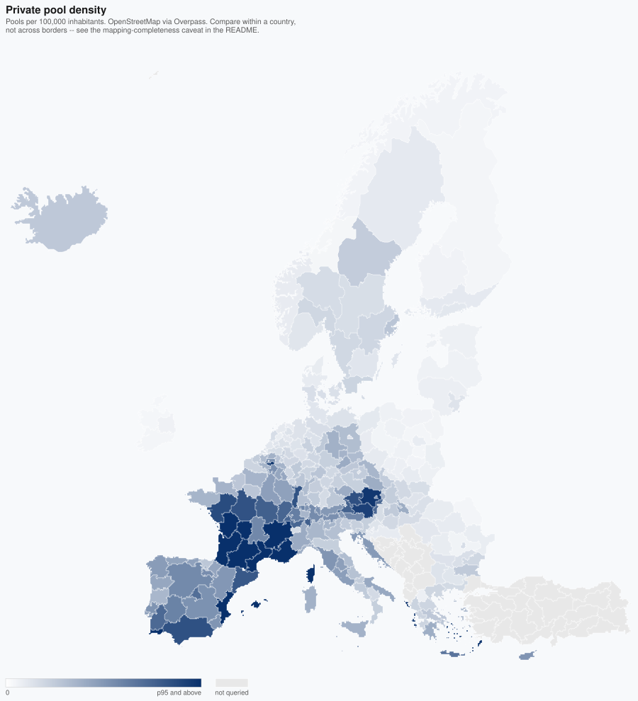
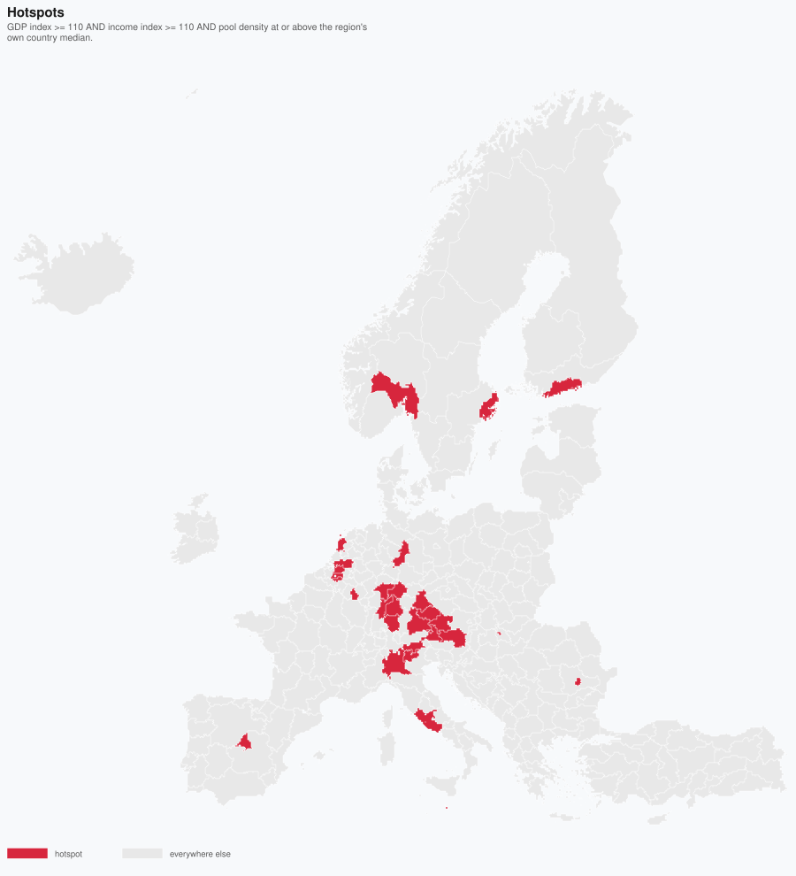

# eu-geomarketing-map

Builds a single GeoJSON file that turns four public datasets into four
ad-targeting maps of Europe — regional wealth, actual household spending power,
and a demand proxy assembled from 1.67 million swimming pools traced by
volunteers.


## The problem

You are deciding where in Europe to spend an advertising budget, at a finer
grain than "France". The obvious move is to rank regions by GDP per capita, and
the obvious move is wrong in a way that is invisible unless you look for it.

The data to do it properly is all public and all free — Eurostat publishes
regional accounts, OpenStreetMap has the ground truth — but it arrives as three
incompatible downloads with no shared join key that a mapping tool will accept,
and free map hosting allows exactly one tileset.

## Two things this map is actually for

### 1. GDP and household income tell different stories, and income is the honest one

Ireland's Eastern and Midland region — Dublin — scores **268** on GDP per capita
where the EU average is 100. Nearly three times as rich as the average European
region.

Its **household disposable income index is 97.1**. Below average.

That is not a data error. Multinationals book European revenue through Irish
subsidiaries, and it lands in regional GDP without ever passing through a
household. The same gap, smaller, shows up wherever headquarters cluster:

| Region | GDP index | Income index | Gap |
|---|---:|---:|---:|
| Eastern and Midland (Dublin) | 268 | 97 | **+171** |
| Southern (IE) | 217 | 100 | +118 |
| Luxembourg | 245 | 150 | +95 |
| Brussels-Capital | 190 | 104 | +86 |
| Praha | 192 | 113 | +79 |

It runs the other way too — commuter belts where people earn elsewhere and spend
at home. Burgenland has a GDP index of 86 and an income index of 133.

**An ad budget allocated on regional GDP will overbid Dublin by a factor of
three and underbid Burgenland by half.** That is the entire argument for
building the income layer, and it is why both views use the same palette and the
same breaks: so you can flip between them and see the disagreement directly.


### 2. Pool density is a demand proxy, not a curiosity

A private swimming pool is a strong, compound signal. It implies a detached
house, a garden, enough disposable income to install it, and — the part that
matters commercially — **guaranteed recurring spend** on pumps, robots,
chemicals, covers and repairs for as long as it exists.

So a map of private pools is a demand map for an entire product category: pool
robots, garden equipment, outdoor furniture, terrace goods. Nobody publishes
that dataset, because it is not a dataset — it is a by-product of volunteers
tracing satellite imagery for a free map.

That is the thesis of this project: **the useful layer is rarely published
anywhere. It gets built by joining two boring datasets nobody thought to
combine.**



Read this layer *within* countries, not across them. See
[Limitations](#notes-and-limitations) — OSM coverage is uneven, and that
unevenness looks exactly like a real signal if you do not know it is there.

## Approach

Free MapTiler accounts allow **one tileset**. Four maps therefore cannot be four
uploads.

But one tileset can feed any number of *style layers*. So instead of computing
colours in the map style, the build script **pre-computes a hex colour per
region per view and bakes it into the feature properties**. The upload is one
file with 299 polygons carrying `fill`, `fill_income`, `fill_pools` and
`fill_hotspot`; each map layer is then a one-line expression, `["get", "fill_income"]`.

This is the central design decision and it is a trade. What you give up is
restyling in the browser — changing a class break means re-running the build.
What you get is four maps inside a free-tier limit, plus a guarantee that the
static previews in this README and the hosted map are showing *literally the
same hex values*, because both read the same baked property.

## How it works

```
download NUTS2 boundaries (GISCO, 1:3M GeoJSON)
download GDP / income / population   (Eurostat JSON-stat API)
download swimming pools              (Overpass API, per country, CSV)
        |
        v
join on NUTS code            boundaries + statistics
count pools per region       shapely point-in-polygon, STRtree-indexed
        |
        v
index to EU27 = 100          income index computed here; GDP ships indexed
compute colour bins per view four hex values written onto every region
        |
        v
write ONE GeoJSON  ->  upload to MapTiler  ->  add it as four style layers
```

Every download is cached on disk. A second run does no network I/O at all,
which is deliberate: colour breaks get tuned far more often than the data
changes, and the Overpass queries are slow enough (and impolite enough to
repeat) that re-running them casually is not acceptable.

## What it does

- Fetches Eurostat `nama_10r_2gdp`, `nama_10r_2hhinc` and `demo_r_d2jan` through
  the JSON-stat API, taking the **latest available year per region** rather than
  a fixed year, because coverage is ragged.
- Computes the EU27 = 100 income index itself — Eurostat publishes GDP as an
  index but not income.
- Queries Overpass for `leisure=swimming_pool` with `access != yes` across 31
  countries, caching each country's response.
- Counts 1.67M pool points into 299 regions by point-in-polygon, using an
  STRtree so it finishes in seconds rather than hours.
- Flags **hotspots**: regions above 110 on both indices *and* at or above their
  own country's median pool density.
- Bakes four colour ramps into the properties and writes one GeoJSON.
- Renders four static SVG previews for this README from that same file.



## Usage

```bash
pip install -r requirements.txt
python build_pps_map.py
```

First run downloads everything (the Overpass stage is the slow one — roughly
40 minutes across 31 countries, with a polite 12-second pause between live
requests). Subsequent runs are served entirely from cache.

Useful flags:

```bash
python build_pps_map.py --datasets gdp,income     # skip the slow pool stage
python build_pps_map.py --pool-countries AT,SI    # fast test run
python build_pps_map.py --year 2023               # reproduce an older build
python build_pps_map.py --refresh eurostat        # re-download stats only
python build_pps_map.py -o out.geojson --resolution 10M
```

`python build_pps_map.py --help` lists them all.

Then regenerate the README images:

```bash
python render_previews.py
```

Overpass responses are **not** refreshable via `--refresh`. Delete the specific
country file in `overpass_cache/` by hand — a full 31-country re-download should
always be a deliberate act, not a flag someone passes by habit.

### The Overpass query

It lives in [`overpass/private_pools.overpassql`](overpass/private_pools.overpassql)
rather than inline in the script, so you can read exactly what was counted and
argue with it. The file explains every tag choice. To run it yourself, paste it
into [overpass-turbo.eu](https://overpass-turbo.eu/) and replace `{{country}}`
with a country code — pick a small one, since overpass-turbo will not draw
France's 826,000 points.

## Output

`eu_market_map.geojson` — 1.84 MB, 299 features, well under MapTiler's 10 MB
Vector Editor limit. Upload this one file.

| Property | Meaning |
|---|---|
| `nuts_id`, `name`, `country` | NUTS2 code, region name, 2-letter country code |
| `pps_index`, `pps_year` | GDP per capita in PPS, EU27 = 100, and its reference year |
| `fill` | Pre-baked hex colour for `pps_index` |
| `income`, `income_index`, `income_year` | Income in PPS, its EU27 = 100 index, reference year |
| `fill_income` | Pre-baked hex colour for `income_index`, same palette as `fill` |
| `hotspot`, `fill_hotspot` | `true` + `#d7263d` where both indices ≥ 110 and pool density ≥ the region's own country median; `false` + `null` otherwise |
| `pool_count` | OSM pools inside the region (`null` where not queried or the download failed) |
| `pools_per_100k` | `pool_count` per 100k inhabitants |
| `fill_pools` | White→deep-blue gradient for `pools_per_100k`, sqrt-eased, clipped at the p95 (≈1431/100k) so France's cadastre imports do not wash everyone else out |

`null` fills render transparent, so put a neutral grey layer underneath for an
explicit "no data" look.

### Publishing to MapTiler

1. Upload `eu_market_map.geojson` once: cloud.maptiler.com → **Tiles** →
   **New tileset** → **Upload file**. Note the source layer name (usually
   `eu_market_map`).
2. Open a map in **Customize** and add the tileset as a polygon layer **four
   times**.
3. Point each copy's fill colour at a different baked property:

   | Layer | Expression |
   |---|---|
   | `gdp` | `["get", "fill"]` |
   | `income` | `["get", "fill_income"]` |
   | `pools` | `["get", "fill_pools"]` |
   | `hotspots` | `["get", "fill_hotspot"]` — **keep on top**; non-hotspots are `null` and render transparent |

4. Toggle layer visibility to switch stories. The hotspot overlay works on top
   of any of them.

<!-- TODO: paste the live MapTiler map URL here before publishing the repo. -->

Shared palette for `fill` / `fill_income` — breaks 50 / 75 / 100 / 125 / 150
(EU average = 100), ColorBrewer YlGnBu:

| `#ffffcc` <50 | `#c7e9b4` 50–75 | `#7fcdbb` 75–100 | `#41b6c4` 100–125 | `#2c7fb8` 125–150 | `#253494` ≥150 |
|---|---|---|---|---|---|

<details>
<summary>Style JSON, if you would rather set breaks in the style than use the baked colours</summary>

Simplest form — one layer per baked fill:

```json
{
  "id": "gdp",
  "type": "fill",
  "source": "your-tileset",
  "source-layer": "eu_market_map",
  "paint": {
    "fill-color": ["coalesce", ["get", "fill"], "#d9d9d9"],
    "fill-opacity": 0.8,
    "fill-outline-color": "#ffffff"
  }
}
```

Duplicate and swap the property. For the hotspot overlay, drop the `coalesce` so
non-hotspots stay transparent:

```json
{
  "id": "hotspots",
  "type": "fill",
  "source": "your-tileset",
  "source-layer": "eu_market_map",
  "paint": { "fill-color": ["get", "fill_hotspot"], "fill-opacity": 0.55 }
}
```

Live breaks on the raw values instead:

```json
"fill-color": [
  "case",
  ["==", ["get", "pps_index"], null], "#d9d9d9",
  ["step", ["get", "pps_index"],
    "#ffffcc", 50, "#c7e9b4", 75, "#7fcdbb",
    100, "#41b6c4", 125, "#2c7fb8", 150, "#253494"]
]
```

…and for pools, an `interpolate` on `pools_per_100k` (clip ~1430, the baked
gradient's p95):

```json
"fill-color": [
  "case",
  ["==", ["get", "pools_per_100k"], null], "#d9d9d9",
  ["interpolate", ["linear"], ["sqrt", ["get", "pools_per_100k"]],
    0, "#ffffff", 37.8, "#08306b"]
]
```

</details>

## Notes and limitations

This section is longer than the feature list on purpose. Most of what can go
wrong with this map is a reading error, not a bug.

### Missing data is common, and it is never silently dropped

Eurostat coverage is ragged: not every region reports every dataset every year.
The build takes the newest year each region has, so **different regions on the
same map can be showing different years**, and the reference year travels with
the value in `pps_year` / `income_year`.

Regions with no value get `null` and a `null` fill, which renders transparent —
they are visibly absent rather than quietly coloured as zero. In the 2026-07
build, out of 299 regions:

| | Missing | Who |
|---|---:|---|
| GDP index | **14** | CH, IS, LI, BA, XK, NO0B |
| Income index | **49** | the above plus TR, RS, AL, ME, MK |
| Pool count | **39** | countries outside the EU27 + EFTA query set |

The build prints every missing region by name on each run.

Two index caveats:

- Regions whose latest income year is 2024 are indexed against the latest EU27
  aggregate available (2023), which flatters them by about a year of nominal
  growth.
- Eurostat has no `PPCS_HAB` unit in `nama_10r_2hhinc`; the per-inhabitant PPS
  unit is `PPS_EU27_2020_HAB`. In `nama_10r_2gdp` the *index* unit is
  `PPS_HAB_EU27_2020` and the near-identical `PPS_EU27_2020_HAB` is the
  *absolute value*. Both traps are handled in the script; both are easy to get
  backwards.

### The pool layer measures mapping effort as much as reality

This is the single biggest interpretation risk in the project.

**Grey means not queried or download failed — never "no pools".** The UK is
excluded because it is not in the NUTS 2024 classification these boundaries use,
so its pools have no region to join to.

**OSM completeness varies enormously by country.** France (826k pools) and Spain
(411k) include bulk cadastre imports. Austria is densely hand-mapped. The build
flags any country whose per-capita rate falls under half its climate/wealth peer
group's median — in the current build:

| Country | Pools/million | Peer median | |
|---|---:|---:|---|
| HR | 1440 | 3905 | Mediterranean |
| IT | 1948 | 3905 | Mediterranean |
| IE | 50 | 147 | Northern |
| LV | 68 | 147 | Northern |
| PL | 89 | 825 | Continental |
| RO | 135 | 825 | Continental |

Low values in those countries mean incomplete mapping, not few pools. Germany
(779/million) and the Netherlands (600) pass the peer test but sit far below
Austria and Switzerland — treat any sharp colour change at a border with
suspicion.

**Compare regions within a country, not across countries.** This is also why the
hotspot criterion uses each region's own country median rather than a European
threshold: a country-relative test neutralises the coverage gap instead of
inheriting it.

**Pool counts are a proxy, not a census.** `access != yes` keeps untagged pools,
which is deliberate — requiring `access=private` would discard almost the whole
dataset — but it means some non-residential pools are included.

### What the previews do and do not show

`render_previews.py` clips to the European mainland (lon −25…45, lat 34…72).
Eight outermost regions — the French DOM, the Azores, Madeira, the Canaries —
are in the data and on the hosted map but omitted from the pictures, because
including them zooms the frame out until Europe is a smudge. One region, ES64
(Melilla, ~12 km²), is too small to draw at this scale and the renderer says so
by name rather than dropping it silently.

## Data snapshot (2026-07 build)

- 285/299 regions with GDP, 250/299 with income, **1,671,420 pool points**
  matched across 31 countries (all downloads succeeded).
- **29 hotspots**: the Austrian/south-German belt (Styria, Upper Austria,
  Salzburg, Stuttgart, Karlsruhe, Tübingen, Ober-/Niederbayern, Oberpfalz,
  Unterfranken, Darmstadt, Braunschweig), Flanders + Brabant wallon, Madrid,
  northern Italy + Lazio, Luxembourg, Malta, Noord-Holland, Noord-Brabant,
  Helsinki, Budapest, Bucharest, Oslo, Stockholm. Dense capitals Vienna and
  Paris fail the country-relative pool criterion.
- Top pool density: Languedoc-Roussillon 5519/100k, Provence-Alpes-Côte d'Azur
  2998, Midi-Pyrénées 2414, Poitou-Charentes 2323, Illes Balears 2294.

## Data sources

All public, all free, no API key required.

| Source | What |
|---|---|
| Eurostat `nama_10r_2gdp` | Regional GDP per capita in PPS, EU27 = 100 |
| Eurostat `nama_10r_2hhinc` | Net disposable household income per inhabitant, PPS |
| Eurostat `demo_r_d2jan` | Population on 1 January, per NUTS2 region |
| Eurostat GISCO | Official NUTS 2024 boundaries as GeoJSON |
| OpenStreetMap / Overpass API | `leisure=swimming_pool`, `access != yes` |
| MapTiler Cloud | Tiling, hosting, styling |

OpenStreetMap data is © OpenStreetMap contributors, available under the
[Open Database License](https://www.openstreetmap.org/copyright). Eurostat data
is reusable under the [Commission's reuse policy](https://ec.europa.eu/eurostat/about-us/policies/copyright).

## Licence

MIT — see [LICENSE](LICENSE).
